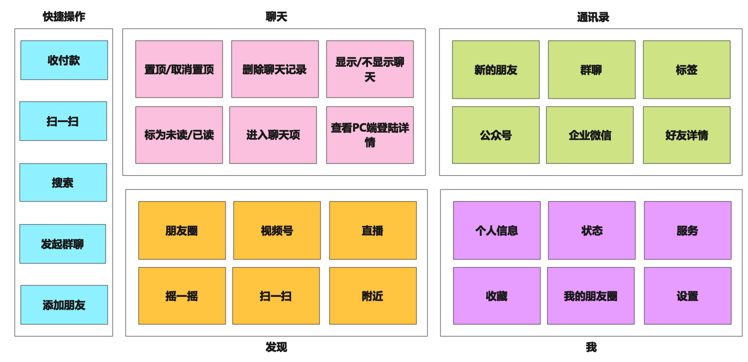
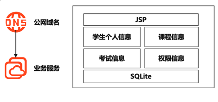
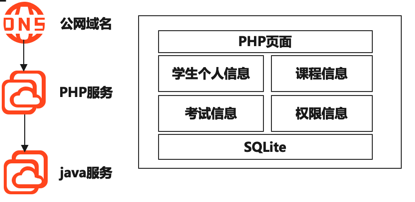
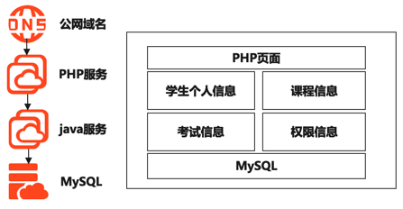

## 微信业务架构图

## 学生管理系统
### 方案一

* 优势：简单且成本低，所有的模块均在一个应用中完成
* 缺点：不能满足要求中的不能太简单规则

### 方案二

* 优势：能够最大程度发挥开发人员特长，PHP高手去开发PHP页面，java开发后端业务逻辑
* 缺点：比方案一要多一个节点，需要更高的成本

### 方案三

* 优势：数据更加安全，当后端服务节点损坏时，数据节点依旧可用
* 缺点：需要的成本最高，且在需求中并不需要非常高的数据可靠性

### 方案取舍
1. 因为是毕设，所以只要可以使用，且理论上能够存储1000个学生的数据信息就足够，因此高可用、高性能、高扩展都不是最重要的
2. 因为都为学生，学生能够支付的成本有限，所以应该在最大程度上降低成本，因此成本应该是最重要的一个考量因素
3. 因为题目限制，不能太过简单，因此最终的架构设计不能只满足使用

结论：最终选择方案二