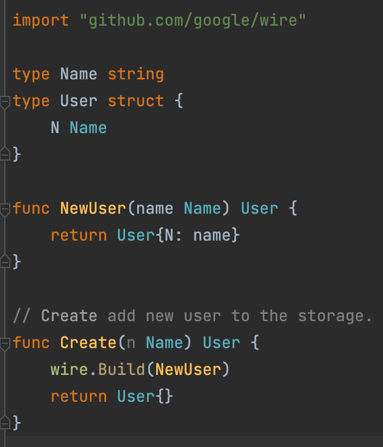

目录结构如下

```shell
tree .
.
├── CHANGELOG
├── CONTRIBUTING.md
├── LICENSE
├── Makefile
├── README.md
├── api
│   ├── openapi
│   │   └── user
│   │       └── v1
│   │           └── user.go
│   └── swagger
├── app.go
├── build
│   ├── ci
│   ├── docker
│   └── package
├── cmd
│   ├── authz-server
│   │   └── authzserver.go
│   └── user-server
│       └── userserver.go
├── configs
├── deployments
├── docs
│   ├── README.md
│   ├── devel
│   ├── guide
│   └── images
├── examples
├── githooks
├── go.mod
├── go.sum
├── init
├── internal
│   ├── authzserver
│   │   ├── biz
│   │   ├── data
│   │   │   ├── fake
│   │   │   └── mysql
│   │   ├── service
│   │   └── testing
│   ├── pkg
│   │   ├── code
│   │   ├── options
│   │   ├── server
│   │   ├── util
│   │   └── validation
│   └── userserver
│       ├── biz
│       │   └── user.go
│       ├── data
│       │   ├── fake
│       │   └── mysql
│       │       └── user.go
│       ├── model
│       │   └── model.go
│       ├── service
│       │   └── user.go
│       └── testing
├── pkg
│   └── util
│       └── genutil
├── scripts
│   ├── lib
│   └── make-rules
├── test
│   └── testdata
├── third_party
│   └── forked
└── tools
```

wire注入熟悉这些api了，但是各个包怎么依赖，运转起来这个还是不太明白，没开发过一个完整的go项目


